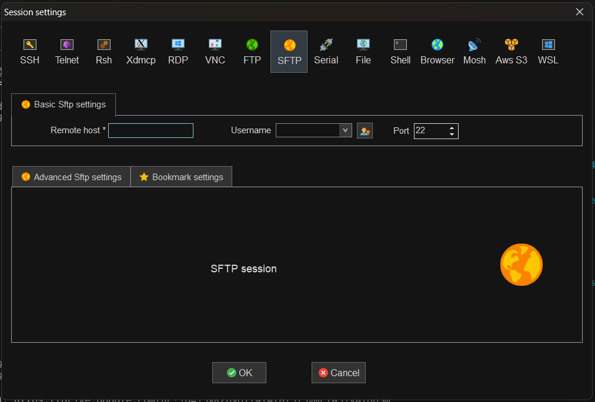

# Practice_OpenFoam_hands-on_LANTA
For new student or interested person that want to get to know OpenFoam and Basic HPC 


### ขั้นตอนการติดตั้งและการใช้งาน
1. **เข้าสู่ระบบ LANTA**:
   - ก่อนอื่นให้เข้าสู่ระบบของเครื่อง LANTA ให้เรียบร้อย
2. **สร้างไดเรกทอรีสำหรับทำงาน**:
   ```bash
   mkdir ~/openFoam
3. **ดาวน์โหลด์ไฟล์ Cavity3D**
   ```bash
   wget -O case.tar.gz "https://drive.google.com/uc?export=download&id=13XKzpyBIl4fwIaf3f5vmcfW31yATB8Sm"

4. **เนื่องด้วยไฟล์อยู่ใน google drive ทำให้ต้องดาวน์โหลด gdown ลงในบัญชีของเรา เพื่อใช้ในการทำการดาวน์โหลดไฟล์**
   ```bash
   pip install gdown --user
5. **ดาวน์โหลด case (ใช่เวลาสักระยะ)**
   ```bash
   gdown "13XKzpyBIl4fwIaf3f5vmcfW31yATB8Sm" -O case.tar.gz
   ```
   หรือจะดาวน์โหลดไฟล์โดยตรงตามลิงก์นี้
   ```bash
   https://drive.google.com/file/d/13XKzpyBIl4fwIaf3f5vmcfW31yATB8Sm/view?usp=drive_link
   ```
   เปิด session ใหม่บน MobaXterm host : transfer.lanta.nstda.or.th และอัปโหลดขึ้นระบบผ่านทางนี้ 
   
7.**แตกไฟล์ case**
   ```bash
   tar -xzvf case.tar.gz
8. **เข้าโฟลเดอร์ case**
   ```bash
   cd case
9. เข้าไปที่ cavity3D
    ```bash
    cd cavity3D-64M
11. **ใช้คำสั่ง pwd เพื่อดูตำแหน่งของไดเรกทอรี**
   ```bash
   pwd
   ``` 
   ถอยกลับมาที่โฟลเดอร์ openFoam
   ```bash
   cd ~/openFoam
   ```
12. **สร้าง link ในการเข้าถึงโฟลเดอร์ทางลัด**
   ```bash
   ln -s ~/case/cavity3D-64M
   ```
13. ** เตรียม Job script ตัดชิ้นส่วนแบ่งเท่าจำนวน core (128 core) => pre_128_cores.sh
```bash
#!/bin/bash
#SBATCH --job-name=OF_pre_1N
#SBATCH --account=tn999996
#SBATCH --partition=compute-limited
#SBATCH --nodes=1
#SBATCH --ntasks=1
#SBATCH --cpus-per-task=64
#SBATCH --time=02:00:00
#SBATCH --output=allpre_1node_%j.out
#SBATCH --error=allpre_1node_%j.err

module purge
module load OpenFOAM/v2212-cpeCray-23.03

cd /home/tn603/openFoam/cavity3D-64M

# runing with using 128 core
   bash Allpre.sh 128
   ``` 
อย่าลืมปลี่ยน tn60X เป็น user ตัวเองนะ 
   ```bash
   sbatch pre_128_cores.sh
   ```
เช็คสถานะการรัน
   ```bash
   myqueue
   ```
14. **เมื่อรัน pre_128_cores เสร็จสิ้น เราจะมารันการจำลองพลศาสตร์ของไหลกัน => run_1_nodes.sh**
```bash
#!/bin/bash
#SBATCH --job-name=OF_run_1N
#SBATCH --account=tn999996
#SBATCH --partition=compute-limited
#SBATCH --nodes=1
#SBATCH --ntasks=128
#SBATCH --time=01:00:00
#SBATCH --output=run_1node_%j.out
#SBATCH --error=run_1node_%j.err


module load OpenFOAM/v2212-cpeCray-23.03

cd /home/tn60x/openFoam/case/decomp/N128


srun -n 128 icoFoam -parallel > log.icoFoam
```
```bash
sbatch run_1_nodes.sh
```
เช็คสถานะการรัน 
  ```bash
   myqueue
   ```
15. 
